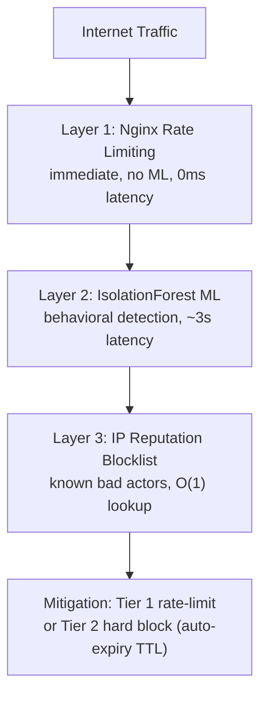

# AI-Driven FinOps & Traffic Shaper

An automated, closed-loop AIOps platform that detects and mitigates
cost-inflating network anomalies (DDoS, scrapers, botnets) in real time
using a 3-layer protection architecture with unsupervised ML at its core.
Deployed on a self-managed Kubernetes cluster with full CI/CD automation.

## System Status

Deployed and verified stable on AWS ap-southeast-1 (1 master + 3 workers).
All services running: Redis, nginx-proxy (with reloader and fluent-bit
sidecars), ai-engine, worker-orchestrator, Prometheus, Grafana, and the
ip-reputation-updater CronJob.

Resolved operational issues are documented in docs/runbook.md under
"Known Issues and Fixes".

## 3-Layer Protection Architecture



End-to-end detection latency: under 3 seconds.

## Key Technical Highlights

### MLOps Pipeline

- Unsupervised anomaly detection using Isolation Forest on 7 configurable
  behavioral features per source IP (Feature Registry pattern)
- 24-hour shadow mode collects baseline traffic before enabling mitigation
- Daily automated retraining with 80/20 train/validation split
- Model validation before promotion: block rate threshold + std regression check
- Feedback loop: whitelisted IPs automatically excluded from training data
- Feature drift detection using standard deviation from training baseline
- Weekly model archival with version history

### Infrastructure

- Self-managed Kubernetes cluster via Terraform on AWS EC2
  (1 master + 3 workers, ap-southeast-1)
- Terraform remote state on S3 + DynamoDB locking
- GitHub Actions OIDC — no static AWS credentials stored
- Kubernetes RBAC scoped to minimum required permissions
- Nginx hot-reload via inotify sidecar — no Docker socket exposure
- FluentBit runs as a sidecar container in the nginx-proxy pod, sharing
  the log volume directly instead of a cluster-wide DaemonSet
- Network Policies restrict inter-pod communication
- PersistentVolumeClaims for model, Prometheus, and Grafana storage
- AWS SSM Parameter Store for automated K8s cluster join, cleared at the
  start of each master init to avoid stale join commands on re-deploy

### Backend & Reliability

- FastAPI with full async architecture (anyio thread pool for ML inference)
- Circuit breaker on AI Engine to Worker Orchestrator HTTP calls
  (5 failure threshold, 30s recovery timeout)
- Pydantic v2 models for all request/response validation
- Redis Sorted Sets for O(log N) sliding window (TTL-based auto-cleanup)
- Redis Stream with MAXLEN for bounded shadow training data storage
- Two-tier progressive mitigation with automatic TTL-based unblock

### Security

- GitHub Actions OIDC (no long-lived AWS credentials)
- X-Internal-Token authentication on all internal service calls
- Kubernetes Network Policies (deny-by-default between services)
- Docker containers run as non-root user (UID 1000)
- Grafana admin password separate from internal service token
- FluentBit RBAC scoped to namespace level only
- Terraform state encrypted at rest in S3
- CI/CD health-check output withholds internal pod IPs, ClusterIPs, and
  NodePort mappings from public Actions logs

## Feature Registry

| Feature | Signal Detected | Enabled |
|---|---|---|
| request_rate | Volumetric DDoS, flood | true |
| error_ratio | Scanner, brute force | true |
| avg_bytes_sent | Scraping, exfiltration | true |
| avg_request_time | Slowloris, exhaustion | true |
| unique_uri_ratio | Path scanner, crawler | true |
| user_agent_entropy | Botnet rotating UA | true |
| post_ratio | Credential stuffing | true |

Add new features by adding to FEATURE_REGISTRY in feature_config.py.
No other code changes required.

## Prometheus Metrics

| Metric | Type | Description |
|---|---|---|
| ai_anomalies_detected_total | Counter | By reason and tier |
| nginx_blocked_ips_total | Gauge | Active hard-block count |
| nginx_rate_limited_ips_total | Gauge | Active rate-limit count |
| estimated_cloud_cost_saved_usd | Counter | Cost savings |
| shadow_mode_active | Gauge | 1=shadow, 0=live |
| feature_drift_score | Gauge | Per-feature drift |
| model_anomaly_score_mean | Gauge | Rolling score mean |
| inference_duration_seconds | Histogram | ML latency |

## Project Structure
aiops-traffic-shaper/
├── terraform/              IaC: VPC, EC2, ECR, S3 backend, OIDC
├── k8s/                    Kubernetes manifests
├── services/
│   ├── ai-engine/          FastAPI + Isolation Forest + Feature Registry
│   └── worker-orchestrator/ Mitigation + ConfigMap patcher
├── config/                 Nginx (rate limiting) + FluentBit
├── scripts/                Automation scripts
├── tests/                  Unit test cases
├── docs/                   Architecture + MLOps design + Runbook
└── .github/workflows/      CI/CD with OIDC auth

## Quick Start

```bash
# 1. Clone and setup
git clone <repo-url>
cd aiops-traffic-shaper
cp .env.example .env
# Fill in .env values

# 2. Setup AWS backend (one time)
bash scripts/setup-backend.sh

# 3. Provision infrastructure
cd terraform && terraform apply

# 4. Build and push images
bash scripts/build-and-push.sh v1.0.0

# 5. Deploy
export INTERNAL_SECRET=$(openssl rand -hex 32)
export GRAFANA_ADMIN_PASSWORD=$(openssl rand -hex 16)
bash scripts/deploy.sh v1.0.0

# 6. Test detection
bash scripts/load-test.sh http://<worker-ip>:30080
bash scripts/simulate-attack.sh http://<worker-ip>:30080 all
```

## Documentation

- [Architecture Design](docs/architecture.md)
- [MLOps Design](docs/mlops-design.md)
- [Operations Runbook](docs/runbook.md)

## Technology Stack

| Layer | Technology |
|---|---|
| Proxy | Nginx 1.25 (rate limiting built-in) |
| Log Forwarding | FluentBit 3.0 (sidecar in nginx-proxy pod) |
| ML Framework | scikit-learn (Isolation Forest) |
| API Framework | FastAPI + Pydantic v2 |
| State Store | Redis 7 |
| Orchestration | Kubernetes 1.29 (kubeadm) |
| Infrastructure | Terraform + AWS EC2 + ECR + S3 |
| Observability | Prometheus + Grafana (7 alerts) |
| CI/CD | GitHub Actions + OIDC |
