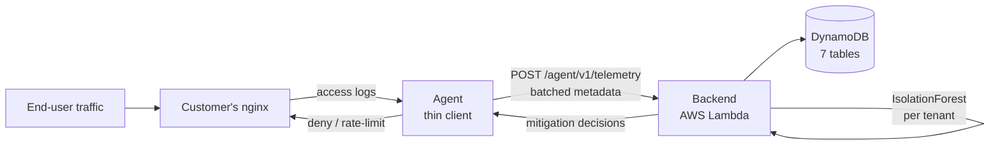

# AI Traffic Shaper

A free, multi-tenant service that detects and mitigates cost-inflating traffic
(DDoS, scrapers, credential stuffing) using unsupervised ML — **without asking
the customer to run any ML infrastructure**.

Customers install a thin agent on their own machine. It forwards request
metadata to a shared backend, receives mitigation decisions back, and enforces
them locally through whatever it finds available (nginx, iptables, or both at
once). All ML lives in the backend, which runs entirely inside AWS's
Always-Free tier — the hard constraint that shaped every decision in
[ADR-002](docs/adr/002-tech-stack-hybrid.md).

## Status — read this first

**Deployed and verified on AWS, 2026-09-21.** Account `375916766707`,
`ap-southeast-1`.

The public entrypoint is a CloudFront distribution; the post-deploy smoke test
passes 5/5 against it, and a backup restore has been performed against the real
DynamoDB tables. 184 tests, 98% line coverage, a clean dependency audit.

**The product has been exercised end to end on production.** A real agent,
registered through the real CLI, sent real telemetry through CloudFront; the
nightly retrain Lambda trained and promoted a per-tenant IsolationForest on 182
live samples; a brute-force IP then came back with a Tier 1 rate-limit decision
while five normal visitors got none; and the agent's own nginx enforcer wrote
the resulting config. 165 log lines from 9 IPs cost exactly 9 DynamoDB items —
the cost property the whole architecture exists for, observed in production.

What has **not** happened is traffic from someone other than the publisher: no
external tenant, and no real nginx reloaded by the agent.

Five defects were found by deploying and running it that nothing else could have found: a
Lambda function URL needs **two** IAM statements for CloudFront rather than one,
the readiness probe needed `dynamodb:DescribeTable` it was never granted, and
the GitHub OIDC provider turned out to be an account-level singleton already
owned by another project, CloudFront silently replaces the `Authorization`
header so no Bearer token ever reached the app, and the nightly retrain failed
at its last step on every run because its return value was not JSON. All five
are fixed; see
[ADR-005](docs/adr/005-cloudfront-oac.md).

## How it works


```mermaid
flowchart LR
    U[End-user traffic] --> N[Customer's nginx]
    N -->|access logs| A[Agent<br/>thin client]
    A -->|POST /agent/v1/telemetry<br/>batched metadata| B[Backend<br/>AWS Lambda]
    B --> D[(DynamoDB<br/>7 tables)]
    B -->|IsolationForest<br/>per tenant| B
    B -->|mitigation decisions| A
    A -->|deny / rate-limit| N
```

1. The agent batches request metadata — never request bodies — and posts it to
   the backend, authenticated with a per-agent API key.
2. The backend aggregates it into one item per *(tenant, IP, 5-second bucket)*
   and computes 7 behavioural features per source IP.
3. A per-tenant IsolationForest scores each feature vector. Score below −0.1
   means **Tier 1, rate limit** (300s); below −0.3 means **Tier 2, hard block**
   (3600s). Above that, nothing happens.
4. Decisions return in the same HTTP response. The agent applies them through
   every enforcement adapter available and removes them itself when the TTL
   expires — nothing else ever will.
5. Every night, EventBridge triggers a retrain per tenant. A new model reaches
   production only through a validation gate that rejects models which would
   block too much normal traffic, or whose score spread has destabilised.

### The 7 features

`request_rate` · `error_ratio` · `avg_bytes_sent` · `avg_request_time` ·
`unique_uri_ratio` · `user_agent_entropy` · `post_ratio`

Computed with a sliding-window counter (current bucket plus a weighted
previous bucket) so a burst split across a bucket boundary is still caught.

## The cost model is the design

The backend must cost ~0 forever, which rules out anything on AWS's 12-month
free tier. That constraint produced the architecture's most distinctive
property: **write cost does not grow with attack volume.**

| Measured | DynamoDB writes |
|---|---|
| 20 log lines from 10 IPs | 12 |
| 200 log lines from 10 IPs | 12 |

Ten of those are the per-IP aggregates; the other two are the global usage
counter and the per-tenant quota counter, one each per *batch*. The number
rose from 11 to 12 when per-tenant quotas arrived — a constant, and the
property that matters is that both rows are equal.

Telemetry is aggregated per IP per time bucket with atomic `ADD` operations,
so a flood costs the same as a trickle from the same attackers — exactly when
a naive per-log-line design would spike the bill. The numbers above come from
`services/backend/tests/test_perf_budget.py`, which counts real DynamoDB API
calls and fails if that property ever regresses.

Everything else follows the same rule: Lambda Function URLs instead of API
Gateway, the model stored as a gzipped blob in a DynamoDB item instead of S3,
server-rendered HTML instead of static hosting.

## Repository layout

```
services/backend/     AWS Lambda: FastAPI via Mangum
  api/                agent, dashboard and admin routes + auth
  core/               DynamoDB access layer, usage metering, config
  ml/                 features, model registry, training, validation gate
  ui/                 server-rendered dashboard + control platform
  retrain_handler.py  EventBridge entry point (separate Lambda)
services/agent/       thin client installed by the customer
  collector.py        batches log records, forwards them
  enforcer/           pluggable adapters: nginx, iptables
  cli.py              register / status
terraform/            the full deployment: CloudFront, Lambdas, tables, Cognito
  bootstrap/          the state bucket, applied once before everything else
config/nginx/         example customer nginx config
scripts/              test runner, traffic simulators
docs/                 PRD, PLAN, architecture, MLOps design, runbook, ADRs
```

## Running the tests

```bash
bash scripts/run_tests.sh
```

Builds a venv from `services/backend/requirements.txt`, then runs exactly what
CI runs: `ruff`, the full suite, and a coverage gate at 80%. Nothing else is
needed — no AWS account, no Redis, no cluster.

> Until Phase 5 this did not work from a clean checkout: `requirements.txt` was
> missing `httpx2` and the suite could not even be collected. If you hit
> something similar, that is a bug in the declared dependencies, not in your
> setup — please report it.

## Running the application locally

```bash
PYTHONPATH=. python scripts/run_local.py      # http://127.0.0.1:8000
```

The whole backend on a laptop, with no AWS account and no network: DynamoDB is
moto in-process, a model is trained at start-up through the real retrain path,
and it prints an owner token, an admin token and an agent key to use. Paste a
token into `/ui/login`, or send telemetry with the agent key.

**Authentication is not weakened.** The real JWT verification runs on every
request — signature, audience, issuer, expiry. Only the source of public keys
changes, to a key pair generated at start-up; a token signed with any other key
is rejected. And it **cannot touch real AWS**: it replaces the environment's
credentials with fake ones before starting, so a call that ever escaped the
mock would fail to authenticate rather than reach production. It binds to
127.0.0.1 only and is not in the deployment package.

## Security posture

Audited in Phase 4 ([docs/security-report.md](docs/security-report.md)); nine
findings, four of them High, all fixed with a failing test written first.

- Cognito ID tokens only — `token_use`, `aud` and `iss` all verified, RS256
  pinned, and authentication fails closed when the pool is unconfigured.
- Tenant isolation is enforced at the data layer: every route derives
  `tenant_id` from the token and uses it as the DynamoDB partition key. No
  route on the tenant surface accepts a tenant identifier from the caller.
- Suspending a tenant actually stops it — agent keys are revoked and
  re-registration is refused.
- The agent does not trust the backend: any value bound for an nginx config is
  validated as an IP address on both ends.
- CSRF double-submit tokens on the cookie-authenticated UI; a full set of
  security headers; unauthenticated traffic is not metered, so it cannot burn
  the free-tier quota.

## Documentation

| Document | What it covers |
|---|---|
| [docs/onboarding.md](docs/onboarding.md) | **Start here if you are inheriting this code** |
| [CHANGELOG.md](CHANGELOG.md) | What changed, and what the rebuild removed |
| [docs/PRD.md](docs/PRD.md) | Product requirements and user stories |
| [docs/PLAN.md](docs/PLAN.md) | Implementation plan, 9 stages |
| [docs/architecture.md](docs/architecture.md) | System design and request flows |
| [docs/mlops-design.md](docs/mlops-design.md) | Model lifecycle, features, validation gate |
| [docs/runbook.md](docs/runbook.md) | Operating and troubleshooting |
| [docs/schema.md](docs/schema.md) | DynamoDB tables and access patterns |
| [docs/api-contract.md](docs/api-contract.md) | HTTP contract |
| [docs/deployment.md](docs/deployment.md) | What gets created, how to deploy, rollback, backup |
| [docs/retrospective.md](docs/retrospective.md) | What the project carried, what got reversed, what is still open and who decides |
| [docs/adr/](docs/adr/) | Architecture decisions, with the reasoning |
| [docs/security-report.md](docs/security-report.md) · [docs/test-report.md](docs/test-report.md) | Audit and verification results |

## Technology

| Layer | Choice | Why |
|---|---|---|
| Compute | AWS Lambda + Mangum | Always Free, no 12-month cutoff |
| Edge | CloudFront + Origin Access Control | Always Free (1 TB, 10M req/month); Shield Standard included; the Lambda URL is not publicly reachable |
| Ingress | Lambda Function URL, `AWS_IAM` | API Gateway is 12-month free only |
| Storage | DynamoDB, provisioned 25 WCU / 25 RCU | Always Free ceiling |
| ML | scikit-learn IsolationForest, 50 estimators | Fits DynamoDB's 400KB item limit gzipped |
| Retraining | EventBridge scheduled rule | No charge for invoking Lambda |
| Auth | Cognito (users) + hashed API keys (agents) | |
| UI | Jinja2, server-rendered from Lambda | Avoids S3 static hosting |
| Agent | Python stdlib + `click` | Genuinely thin: no ML, no SDK |

## Known gaps

- **No traffic from anyone but the publisher.** The full loop has run on
  production with a demo tenant (`acme-demo`); no external tenant has.
- **Human credentials travel in `X-Id-Token`, not `Authorization`** — CloudFront
  replaces the latter. The CLI and UI handle it; other API clients must too.
- **POST requests must carry `x-amz-content-sha256`.** CloudFront's origin
  access control signs the request but not the body, so every client sending a
  body hashes it first. The agent and the UI do this; anything else calling the
  API must too ([ADR-005](docs/adr/005-cloudfront-oac.md)).
- No Cognito Hosted UI: both the CLI and the web UI take a pasted ID token.
- Throttling is coarse: at 100% of the day's free-tier share, telemetry
  ingest is refused wholesale rather than shaped per tenant, so one noisy
  tenant can pause ingest for everyone.
- No rate limiting at the edge — a consequence of dropping API Gateway for
  cost, accepted in ADR-002.
- Backup is manual (`scripts/backup-tables.sh`); an unattended schedule that
  costs nothing does not exist. See docs/deployment.md.
