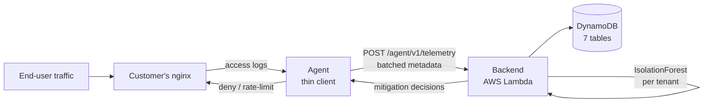

# AI Traffic Shaper

A free, multi-tenant service that detects and mitigates cost-inflating traffic
(DDoS, scrapers, credential stuffing) using unsupervised ML — **without asking
the customer to run any ML infrastructure**.

Customers install a thin agent on their own machine. It forwards request
metadata to a shared backend, receives mitigation decisions back, and enforces
them locally through whatever it finds available (nginx, iptables, or both at
once). All ML lives in the backend, which runs entirely inside AWS's
Always-Free tier — the hard constraint that shaped every decision in
[ADR-002](docs/adr/002-tech-stack-hybrid.md).

## Status — read this first

**Never deployed. Verified locally only.**

The backend and agent are complete and tested — 164 tests, 98% line coverage,
a clean dependency audit — but every test runs against `moto` (an in-process
DynamoDB simulator) and locally signed JWTs. No Lambda, no Cognito user pool,
and no live DynamoDB table has ever run. Provisioning the real infrastructure
is Phase 7 and has not started; `terraform/` currently holds only the two
modules that will survive into it (see [terraform/README.md](terraform/README.md)).

An earlier version of this README claimed the system was "deployed and verified
stable on AWS". That was never true, and it described a different architecture
besides — one replaced by ADR-002 in August 2026.

## How it works


```mermaid
flowchart LR
    U[End-user traffic] --> N[Customer's nginx]
    N -->|access logs| A[Agent<br/>thin client]
    A -->|POST /agent/v1/telemetry<br/>batched metadata| B[Backend<br/>AWS Lambda]
    B --> D[(DynamoDB<br/>7 tables)]
    B -->|IsolationForest<br/>per tenant| B
    B -->|mitigation decisions| A
    A -->|deny / rate-limit| N
```

1. The agent batches request metadata — never request bodies — and posts it to
   the backend, authenticated with a per-agent API key.
2. The backend aggregates it into one item per *(tenant, IP, 5-second bucket)*
   and computes 7 behavioural features per source IP.
3. A per-tenant IsolationForest scores each feature vector. Score below −0.1
   means **Tier 1, rate limit** (300s); below −0.3 means **Tier 2, hard block**
   (3600s). Above that, nothing happens.
4. Decisions return in the same HTTP response. The agent applies them through
   every enforcement adapter available and removes them itself when the TTL
   expires — nothing else ever will.
5. Every night, EventBridge triggers a retrain per tenant. A new model reaches
   production only through a validation gate that rejects models which would
   block too much normal traffic, or whose score spread has destabilised.

### The 7 features

`request_rate` · `error_ratio` · `avg_bytes_sent` · `avg_request_time` ·
`unique_uri_ratio` · `user_agent_entropy` · `post_ratio`

Computed with a sliding-window counter (current bucket plus a weighted
previous bucket) so a burst split across a bucket boundary is still caught.

## The cost model is the design

The backend must cost ~0 forever, which rules out anything on AWS's 12-month
free tier. That constraint produced the architecture's most distinctive
property: **write cost does not grow with attack volume.**

| Measured | DynamoDB writes |
|---|---|
| 20 log lines from 10 IPs | 11 |
| 200 log lines from 10 IPs | 11 |

Telemetry is aggregated per IP per time bucket with atomic `ADD` operations,
so a flood costs the same as a trickle from the same attackers — exactly when
a naive per-log-line design would spike the bill. The numbers above come from
`services/backend/tests/test_perf_budget.py`, which counts real DynamoDB API
calls and fails if that property ever regresses.

Everything else follows the same rule: Lambda Function URLs instead of API
Gateway, the model stored as a gzipped blob in a DynamoDB item instead of S3,
server-rendered HTML instead of static hosting.

## Repository layout

```
services/backend/     AWS Lambda: FastAPI via Mangum
  api/                agent, dashboard and admin routes + auth
  core/               DynamoDB access layer, usage metering, config
  ml/                 features, model registry, training, validation gate
  ui/                 server-rendered dashboard + control platform
  retrain_handler.py  EventBridge entry point (separate Lambda)
services/agent/       thin client installed by the customer
  collector.py        batches log records, forwards them
  enforcer/           pluggable adapters: nginx, iptables
  cli.py              register / status
terraform/            only what survives into Phase 7
config/nginx/         example customer nginx config
scripts/              test runner, traffic simulators
docs/                 PRD, PLAN, architecture, MLOps design, runbook, ADRs
```

## Running the tests

```bash
bash scripts/run_tests.sh
```

Builds a venv from `services/backend/requirements.txt`, then runs exactly what
CI runs: `ruff`, the full suite, and a coverage gate at 80%. Nothing else is
needed — no AWS account, no Redis, no cluster.

> Until Phase 5 this did not work from a clean checkout: `requirements.txt` was
> missing `httpx2` and the suite could not even be collected. If you hit
> something similar, that is a bug in the declared dependencies, not in your
> setup — please report it.

**Running the full application locally is not currently supported.** The app
needs real DynamoDB and a real Cognito pool; the temporary mock harness that
made the UI viewable offline was removed. Restoring a supported local-run path
is open work.

## Security posture

Audited in Phase 4 ([docs/security-report.md](docs/security-report.md)); nine
findings, four of them High, all fixed with a failing test written first.

- Cognito ID tokens only — `token_use`, `aud` and `iss` all verified, RS256
  pinned, and authentication fails closed when the pool is unconfigured.
- Tenant isolation is enforced at the data layer: every route derives
  `tenant_id` from the token and uses it as the DynamoDB partition key. No
  route on the tenant surface accepts a tenant identifier from the caller.
- Suspending a tenant actually stops it — agent keys are revoked and
  re-registration is refused.
- The agent does not trust the backend: any value bound for an nginx config is
  validated as an IP address on both ends.
- CSRF double-submit tokens on the cookie-authenticated UI; a full set of
  security headers; unauthenticated traffic is not metered, so it cannot burn
  the free-tier quota.

## Documentation

| Document | What it covers |
|---|---|
| [docs/onboarding.md](docs/onboarding.md) | **Start here if you are inheriting this code** |
| [CHANGELOG.md](CHANGELOG.md) | What changed, and what the rebuild removed |
| [docs/PRD.md](docs/PRD.md) | Product requirements and user stories |
| [docs/PLAN.md](docs/PLAN.md) | Implementation plan, 9 stages |
| [docs/architecture.md](docs/architecture.md) | System design and request flows |
| [docs/mlops-design.md](docs/mlops-design.md) | Model lifecycle, features, validation gate |
| [docs/runbook.md](docs/runbook.md) | Operating and troubleshooting |
| [docs/schema.md](docs/schema.md) | DynamoDB tables and access patterns |
| [docs/api-contract.md](docs/api-contract.md) | HTTP contract |
| [docs/adr/](docs/adr/) | Architecture decisions, with the reasoning |
| [docs/security-report.md](docs/security-report.md) · [docs/test-report.md](docs/test-report.md) | Audit and verification results |

## Technology

| Layer | Choice | Why |
|---|---|---|
| Compute | AWS Lambda + Mangum | Always Free, no 12-month cutoff |
| Ingress | Lambda Function URLs | API Gateway is 12-month free only |
| Storage | DynamoDB, provisioned 25 WCU / 25 RCU | Always Free ceiling |
| ML | scikit-learn IsolationForest, 50 estimators | Fits DynamoDB's 400KB item limit gzipped |
| Retraining | EventBridge scheduled rule | No charge for invoking Lambda |
| Auth | Cognito (users) + hashed API keys (agents) | |
| UI | Jinja2, server-rendered from Lambda | Avoids S3 static hosting |
| Agent | Python stdlib + `click` | Genuinely thin: no ML, no SDK |

## Known gaps

- Never run on real AWS (PRD US-9).
- No Cognito Hosted UI: both the CLI and the web UI take a pasted ID token.
- Throttling is coarse: at 100% of the day's free-tier share, telemetry
  ingest is refused wholesale rather than shaped per tenant, so one noisy
  tenant can pause ingest for everyone.
- No rate limiting at the edge — a consequence of dropping API Gateway for
  cost, accepted in ADR-002.
- No supported way to run the application locally (see above).
