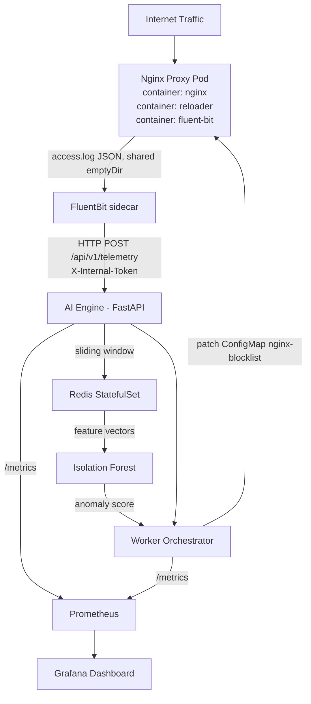

# System Architecture: AI-Driven FinOps & Traffic Shaper

## Overview

An automated, closed-loop AIOps platform that ingests live Nginx access logs,
extracts rolling time-series features per source IP, applies unsupervised ML
to detect cost-inflating anomalies, and executes zero-downtime mitigations
directly at the proxy layer — all within a 5-second end-to-end latency budget.

## Component Diagram

## Five-Tier Architecture

### Tier 1 — Ingestion (Nginx + FluentBit sidecar)

Nginx emits structured JSON access logs to an emptyDir volume shared within
the pod. FluentBit runs as a second sidecar container in the same
nginx-proxy pod, tailing the log file and forwarding batches to the AI
Engine via authenticated HTTP POST every 1 second. A db tracking file
ensures FluentBit survives restarts without re-reading historical logs.

FluentBit runs inside the nginx-proxy pod rather than as a cluster-wide
DaemonSet because nginx-proxy runs a single replica. A DaemonSet pod on a
different node cannot see another pod's emptyDir volume, since emptyDir is
scoped per-pod rather than per-node. Colocating both containers in the same
pod is the correct way to share that volume with a single-replica
Deployment.

### Tier 2 — Intelligence (FastAPI + Isolation Forest)

The AI Engine receives log batches, stores per-IP records in Redis Sorted Sets
(scored by Unix timestamp), and computes a 7-feature vector for each IP with
at least 3 requests in the 5-second sliding window. Feature computation and
ML inference run in an anyio thread pool to avoid blocking the ASGI event loop.

### Tier 3 — Mitigation (Worker Orchestrator)

On receiving an anomaly signal, the Worker Orchestrator validates the internal
token, checks the whitelist, and applies a graduated response. All block rules
carry a Redis TTL and are automatically removed by an APScheduler cleanup job
every 60 seconds. Nginx is reloaded via a sidecar container watching the
ConfigMap mount with inotify — no Docker socket required.

### Tier 4 — State (Redis)

Redis is the single source of truth for all runtime state. It stores sliding
window data, whitelist entries, active mitigation keys with TTLs, shadow mode
training streams, and model metadata. Using Redis instead of in-memory state
ensures consistency across container restarts and potential horizontal scaling.

### Tier 5 — Observability (Prometheus + Grafana)

Both services expose a /metrics endpoint scraped by Prometheus every 15
seconds. Grafana provides dashboards for traffic anomalies, active blocks,
cost savings, model health, and feature drift.

## Security Model

| Layer | Mechanism |
|---|---|
| VM Firewall | Only ports 22, 80, 443, 30300 exposed (restrict to your IP where possible) |
| K8s Network Policy | Redis: ai-engine + worker only. Worker: ai-engine only. AI Engine: nginx-proxy pod only |
| Internal Auth | X-Internal-Token header on all API calls, validated via FastAPI Security dependency |
| RBAC | worker-orchestrator ServiceAccount, Role scoped to patch ConfigMap nginx-blocklist only |
| No Docker Socket | Nginx reload via inotify + sidecar pattern |

## Data Flow (end-to-end)

| Step | Component | Action | Latency |
|---|---|---|---|
| 1 | Nginx | Write JSON log record | ~1ms |
| 2 | FluentBit sidecar | Tail and POST to AI Engine | ~1s |
| 3 | AI Engine | Store to Redis Sorted Set | ~5ms |
| 4 | AI Engine | Query 5s window, compute 7 features | ~10ms |
| 5 | AI Engine | Isolation Forest inference | ~20ms |
| 6 | AI Engine | POST mitigate to Worker | ~5ms |
| 7 | Worker | Patch ConfigMap blocklist | ~50ms |
| 8 | K8s | Update ConfigMap volume mount | ~1-2s |
| 9 | Nginx sidecar | inotify detect + reload | ~500ms |

Total: under 3s. Budget: 5s.

## Key Design Decisions

### Why Isolation Forest

Isolation Forest isolates anomalies rather than profiling normality. This fits
production networks where attack signatures change dynamically and labelled
malicious data is unavailable. The unsupervised approach means the model adapts
to legitimate traffic patterns automatically through weekly retraining.

### Why Redis Sorted Sets for Sliding Windows

Sorted Sets with Unix timestamps as scores allow O(log N) insertion and O(log N)
range queries. ZRANGEBYSCORE with a 5-second window efficiently retrieves only
relevant records. ZREMRANGEBYSCORE prunes stale records on every read. Key TTLs
handle cleanup for IPs that stop sending traffic.

### Why Signal File Instead of Docker Socket

Mounting /var/run/docker.sock grants full Docker daemon control to any process
in the container. The inotify-based sidecar pattern achieves the same reload
behaviour with zero privilege escalation risk.

### Why FluentBit as a Sidecar Instead of a DaemonSet

A DaemonSet places one FluentBit pod per node, which is appropriate when
every node runs the workload being logged. Here, nginx-proxy runs a single
replica on one node at a time, and Kubernetes emptyDir volumes are scoped
per-pod rather than per-node — two pods on the same node still get separate,
isolated emptyDir storage. A cluster-wide DaemonSet therefore could not read
nginx's log file even when scheduled onto the same node. Running FluentBit
as a second container inside the nginx-proxy pod lets both containers mount
the exact same emptyDir volume, which is the correct fix for a single-replica
log source.

### Why Not Kafka in v1

FluentBit's built-in disk buffer handles backpressure for moderate traffic
spikes. The FluentBit output plugin is the only component that needs changing
to introduce Kafka — the AI Engine interface remains identical. This keeps v1
operationally simple while preserving a clear upgrade path.
