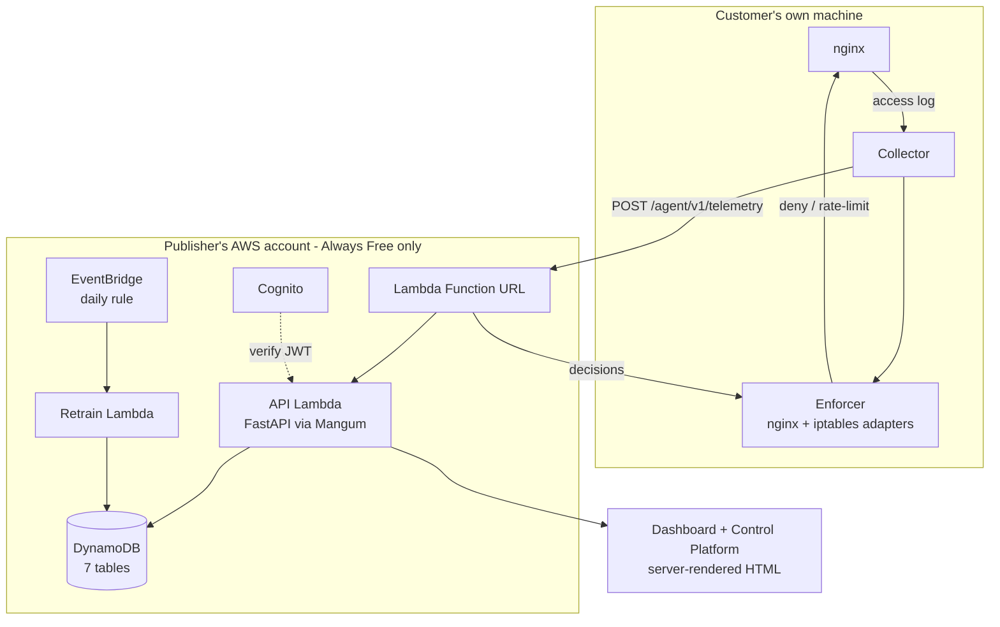
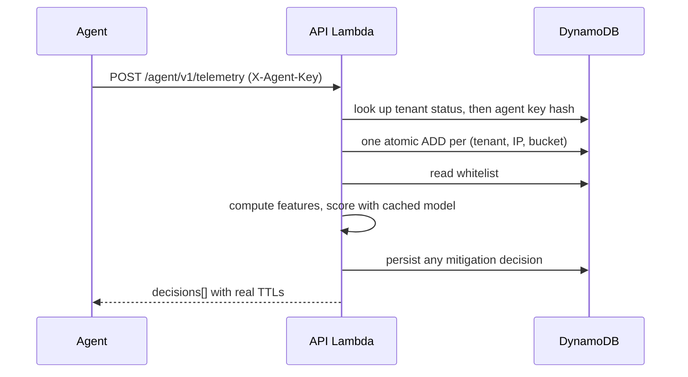

# System Architecture — AI Traffic Shaper (hybrid model)

> Rewritten 2026-08-24 for the architecture chosen in
> [ADR-002](adr/002-tech-stack-hybrid.md). The previous version described the
> original single-tenant model (self-managed Kubernetes on EC2, Redis,
> Prometheus); it is in git history and no longer reflects anything that runs.

## The shape of the system, and why

Two parties, and the split between them is the whole design:

- **The customer** installs a thin agent next to their own web server. They
  never run ML, never provision infrastructure, never see another customer.
- **The publisher** runs one shared backend for every customer, and pays for
  it. The bill must stay at approximately zero, forever.

That second constraint is not a preference — it is the reason this
architecture exists at all. Every component below was chosen because it sits
inside AWS's *Always Free* tier rather than the 12-month free tier.

```mermaid
flowchart TB
    subgraph Customer["Customer's own machine"]
        NG[nginx] -->|access log| CO[Collector]
        CO --> EN[Enforcer<br/>nginx + iptables adapters]
        EN -->|deny / rate-limit| NG
    end

    subgraph AWS["Publisher's AWS account - Always Free only"]
        FU[Lambda Function URL] --> API[API Lambda<br/>FastAPI via Mangum]
        API --> DDB[(DynamoDB<br/>7 tables)]
        EB[EventBridge<br/>daily rule] --> RT[Retrain Lambda]
        RT --> DDB
        COG[Cognito] -.->|verify JWT| API
    end

    CO -->|POST /agent/v1/telemetry| FU
    FU -->|decisions| EN
    API --> UI[Dashboard + Control Platform<br/>server-rendered HTML]
```

## Components

### Agent — `services/agent/`

Deliberately thin: no scikit-learn, no AWS SDK, no HTTP library. Only `click`
for the CLI and Python's own `urllib`.

| Module | Responsibility |
|---|---|
| `collector.py` | Batches request metadata (100 records or 5 seconds) and posts it |
| `enforcer/base.py` | The `EnforcementAdapter` interface |
| `enforcer/nginx_adapter.py` | Writes `deny` lines and a `geo` map into `conf.d`, reloads nginx |
| `enforcer/iptables_adapter.py` | OS-level DROP rules; hard block only |
| `enforcer/__init__.py` | Adapter auto-detection and `DecisionStore` (TTL sweeping) |
| `cli.py` | `register` and `status` |

**Pluggable enforcement is the deliberate improvement.** fail2ban binds you to
one action chosen at install time; CrowdSec introduced pluggable "bouncers"
but still one decision path. Here, `detect_adapters()` keeps *every* adapter
that reports itself available, so nginx and iptables can enforce the same hard
block simultaneously — defence in depth, and it works across more environments
with no per-install configuration.

Two properties matter as much as the mechanism:

- **The agent does not trust the backend.** Any value destined for an nginx
  config is validated as an IP address before it touches disk. A crafted string
  containing a newline would otherwise inject arbitrary nginx directives onto
  the customer's own machine.
- **The agent owns expiry.** Neither an nginx `deny` line nor an iptables rule
  expires on its own. `DecisionStore.sweep_expired()` removes them when their
  TTL passes; if the backend is unreachable, existing blocks stand and local
  expiry keeps working.

### Backend — `services/backend/`

One FastAPI app behind Mangum, exposed through a Lambda Function URL. A second,
independent Lambda handles retraining.

| Package | Responsibility |
|---|---|
| `api/routes/agent.py` | `register`, `telemetry`, `decisions` — agent-facing |
| `api/routes/dashboard.py` | Tenant-scoped: mitigations, whitelist, model status |
| `api/routes/admin.py`, `admin_usage.py` | Cross-tenant: tenants, agents, usage |
| `api/cognito_auth.py` | JWT verification for humans |
| `api/dependencies.py` | API-key auth for agents |
| `core/tables.py` | DynamoDB access layer; `create_all_tables()` applies schema |
| `core/usage.py` | Free-tier metering |
| `ml/` | Features, registry, training, validation — see [mlops-design.md](mlops-design.md) |
| `ui/` | Jinja2 pages plus a ~70-line attribute-driven JS helper |
| `retrain_handler.py` | EventBridge entry point, a separate Lambda |

The two Lambdas share no memory. The API Lambda caches a loaded model per
tenant across warm invocations; the retrain Lambda cannot invalidate that
cache, so a freshly promoted model reaches live traffic when warm containers
recycle naturally. That is a documented consequence, not an oversight.

## Request flows

### Telemetry — the hot path

```mermaid
sequenceDiagram
    participant A as Agent
    participant L as API Lambda
    participant D as DynamoDB
    A->>L: POST /agent/v1/telemetry (X-Agent-Key)
    L->>D: look up tenant status, then agent key hash
    L->>D: one atomic ADD per (tenant, IP, bucket)
    L->>D: read whitelist
    L->>L: compute features, score with cached model
    L->>D: persist any mitigation decision
    L-->>A: decisions[] with real TTLs
```

Auth checks the **tenant** before the agent: a suspended tenant is refused no
matter how healthy its agent records look.

### Human access

Two surfaces, one auth path. `/dashboard/*` is tenant-scoped;
`/admin/*` requires Cognito group `admin`. Both accept a Bearer header (for
API clients) or an `id_token` cookie (for browser navigation, which cannot
attach custom headers) and funnel into the same verification. State-changing
UI requests additionally carry a CSRF double-submit token; the JSON API does
not, because a cross-site form cannot set an `Authorization` header anyway.

## Data model

Seven DynamoDB tables, provisioned within a combined 25 WCU / 25 RCU. Full
detail in [schema.md](schema.md); the shape that matters here:

| Table | Key | Note |
|---|---|---|
| `Tenants` | `tenant_id` | Suspension is enforced, not decorative |
| `Agents` | `tenant_id` + `agent_id` | GSI `LastSeenIndex` on `status` for cross-tenant health |
| `TelemetryEvents` | `{tenant}#{ip}` + `bucket_start_ts` | Aggregates, TTL 25h; GSI `TenantIndex` for retraining |
| `MitigationState` | `tenant_id` + `ip` | Active decisions with expiry |
| `Whitelist` | `tenant_id` + `ip` | Excluded from mitigation *and* from training |
| `Models` | `tenant_id` + `stage_version` | Gzipped joblib blob in the item |
| `UsageCounters` | `date` | Free-tier ceiling tracking |

**Tenant isolation is structural.** Every tenant-facing query uses `tenant_id`
as the partition key, taken from the verified token — never from a path, query
or body parameter. There is no request shape that could ask for another
tenant's data.

## Cost as a first-class constraint

`TelemetryEvents` stores one aggregate item per *(tenant, IP, bucket)*, updated
with atomic numeric `ADD`. An earlier draft stored one item per log line plus
growing lists of URIs and user agents; both were rejected before sign-off
because write cost would scale with request volume — spiking precisely during
an attack.

Measured: 20 log lines from 10 IPs costs 11 writes; **200 log lines from the
same 10 IPs also costs 11**. `test_perf_budget.py` asserts this permanently.

Metering counts authenticated work only. Unauthenticated requests, health
checks and the login page write nothing, so anonymous traffic cannot spend the
free-tier quota — a mitigation, not a cure, since the Function URL still has no
edge rate limiting.

## What this architecture does not have yet

- **Any deployed infrastructure.** No Terraform describes the Lambdas, tables,
  EventBridge rule or Cognito pool. Tables are created by `create_all_tables()`
  from application code. Phase 7 work.
- **Throttling.** Usage is measured; nothing limits it at the ceiling.
- **Edge rate limiting.** Dropped with API Gateway, accepted in ADR-002.
