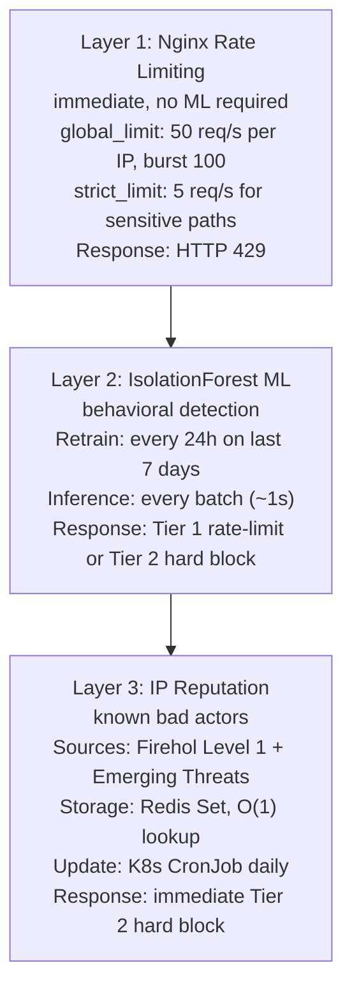
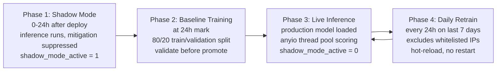

# MLOps Design: AI-Driven FinOps & Traffic Shaper
# Version: 2.0

## Problem Statement

Traditional rule-based firewalls require manual signature updates and cannot
adapt to novel attack patterns. This system uses unsupervised ML to learn
normal traffic behaviour and automatically flag deviations without requiring
labelled attack data.

## 3-Layer Protection Architecture

## Feature Registry

Features are defined in core/feature_config.py as a registry.
Each feature can be enabled or disabled without code changes.

| Feature | Enabled | Signal Detected |
|---|---|---|
| request_rate | true | Volumetric DDoS, HTTP flood |
| error_ratio | true | Scanner, brute force |
| avg_bytes_sent | true | Scraping, data exfiltration |
| avg_request_time | true | Slowloris, conn exhaustion |
| unique_uri_ratio | true | Path scanner, crawler |
| user_agent_entropy | true | Botnet with rotating UA |
| post_ratio | true | Credential stuffing |

To add a new feature:
1. Add FeatureDefinition to FEATURE_REGISTRY in feature_config.py
2. Add computation logic in feature_engineering.py
3. Retrain model — new feature automatically included

## Model Lifecycle

### Phase 1: Shadow Mode (0 to 24h after deploy)

Inference runs but mitigation is suppressed. All feature vectors and
scores are stored to Redis Stream training:shadow_data (MAXLEN=500000).
Operators observe score distribution via Grafana.
shadow_mode_active Prometheus metric = 1.

### Phase 2: Baseline Training (at 24h mark)

APScheduler triggers run_baseline_training().
Reads shadow data from Redis Stream (7 days retained).
Excludes IPs in training:excluded_ips (false positives from whitelist).
Splits data 80% train / 20% validation.
Fits IsolationForest on cleaned feature matrix.
Runs validate_model() — rejects model if block rate > 15% or std regression.
Saves valid model to /app/models/staging/.
If no production model exists, immediately promotes to production.
shadow_mode_active metric = 0.

### Phase 3: Live Inference

model_manager loads production model at startup.
Scores computed per batch via anyio thread pool.
Anomalies trigger mitigation via Worker Orchestrator with circuit breaker.

### Phase 4: Daily Retrain

APScheduler runs run_daily_retrain() every 24 hours.
Uses most recent 7 days of shadow stream data.
Excludes whitelisted IPs (feedback loop).
Validates staging vs production before promoting.
model_manager.reload() loads new weights without restart.
Old model archived with timestamp.

## Feedback Loop

When an operator whitelists an IP:
1. IP added to Redis Set whitelist:ips (stops mitigation)
2. IP added to Redis Set training:excluded_ips (stops training on this IP)
3. Next retrain automatically excludes this IP from training data
4. Model will not learn to treat this IP as normal
5. If IP later shows anomalous behavior, model will still detect it

To re-include an IP in training:
`DELETE /api/v1/whitelist/{ip}/training-exclusion`

## Model Validation

Before promoting staging to production, validate_model() checks:

1. **Block rate <= 15%.** If staging blocks more than 15% of validation
   data, it is too aggressive. Likely cause: contamination parameter too
   high or training data too clean.
2. **Score std regression <= 0.05.** If staging score std increases
   significantly vs production, the model has become unstable. Likely
   cause: data quality issue.
3. **Minimum 50 validation samples required.**

## Circuit Breaker (AI Engine to Worker Orchestrator)

| State | Behavior |
|---|---|
| CLOSED (normal) | Requests pass through to Worker Orchestrator |
| OPEN (after 5 consecutive failures) | Requests blocked, mitigation skipped. AI Engine continues inference and logging. Nginx rate limiting (Layer 1) still active |
| HALF_OPEN (after 30s recovery timeout) | One request allowed through. Success moves back to CLOSED, failure moves back to OPEN |

This ensures AI Engine continues operating even when Worker Orchestrator
is unavailable. Layer 1 (Nginx rate limiting) provides baseline protection.

## Model Storage
/app/models/ (PersistentVolumeClaim: 5Gi)
├── production/
│   ├── isolation_forest.joblib
│   └── metadata.json
├── staging/
│   ├── isolation_forest.joblib
│   └── metadata.json
└── archive/
└── v20260101120000_20260108/
├── isolation_forest.joblib
└── metadata.json

PVC ensures model survives pod restarts. No retraining needed after restart.

## Prometheus Metrics (ML-specific)

| Metric | Type | Description |
|---|---|---|
| model_anomaly_score_mean | Gauge | Rolling mean of recent scores |
| model_anomaly_score_std | Gauge | Rolling std of recent scores |
| feature_drift_score | Gauge | Per-feature drift from baseline |
| model_version_active | Gauge | Active model version |
| training_samples_total | Gauge | Samples in last training run |
| model_retrain_total | Counter | Total retraining runs |
| inference_duration_seconds | Histogram | ML inference latency |
| shadow_mode_active | Gauge | 1=shadow, 0=live |

## Alerting Rules

| Rule | Condition | Severity |
|---|---|---|
| HighAnomalyRate | rate > 10/s for 2m | warning |
| MassiveAttack | rate > 50/s for 30s | critical |
| FeatureDriftDetected | drift > 2 sigma for 5m | warning |
| AIEngineDown | up == 0 for 1m | critical |
| WorkerOrchestratorDown | up == 0 for 1m | critical |
| HighBlockedIPCount | blocks > 1000 for 5m | warning |
| CircuitBreakerOpen | anomalies without blocks | warning |
