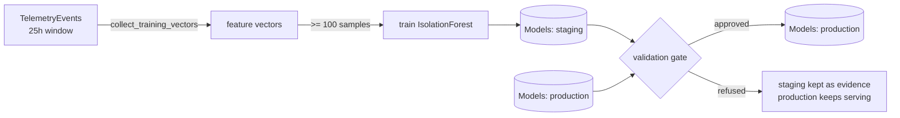

# MLOps Design — AI Traffic Shaper (hybrid model)

> Rewritten 2026-08-24 for the per-tenant, serverless model. The previous
> version described a single-tenant pipeline backed by Redis and a shared
> filesystem; it is in git history.

## The problem

Rule-based firewalls need someone to write the rules and keep writing them.
They cannot describe "this IP is behaving unlike every other IP on this site
today". That is what an unsupervised model is for — and because every
customer's normal traffic looks different, **one shared model would be wrong
for everyone**. Each tenant gets its own.

## Why IsolationForest

| Requirement | Consequence |
|---|---|
| No labelled attack data exists | Unsupervised only |
| Must train inside a Lambda, nightly, for free | Cheap to fit; no GPU |
| Model must fit in a DynamoDB item (400 KB) | 50 estimators, gzipped ≈ fits; 100 measured ≈ 474 KB and did not |
| Must score in milliseconds on the hot path | Tree traversal, no feature store lookup |

IsolationForest satisfies all four. The 50-estimator ceiling is a measured
constraint, not a guess — raising it requires re-measuring the gzipped blob
against the item limit.

## Features

Seven behavioural signals per source IP, computed in Lambda memory from
aggregated counters:

| Feature | Detects |
|---|---|
| `request_rate` | Volumetric flood |
| `error_ratio` | Scanners, brute force |
| `avg_bytes_sent` | Scraping, exfiltration |
| `avg_request_time` | Slowloris, resource exhaustion |
| `unique_uri_ratio` | Path scanning, crawling |
| `user_agent_entropy` | Botnets rotating user agents |
| `post_ratio` | Credential stuffing |

Defined once in `FEATURE_NAMES` and computed by a single shared function used
by **both** the real-time scoring path and the training path. That sharing is
deliberate: duplicating the formulas would let inference and training silently
compute different things under the same field names — a failure mode specific
to ML systems, and a quiet one.

### Sliding window

Features come from a fixed 5-second bucket **plus a weighted share of the
previous bucket**. A naive fixed-bucket design is evadable: an attacker who
straddles the boundary halves their apparent rate in both buckets. The
weighted read closes that gap without storing per-request data.

Storage is one item per *(tenant, IP, bucket)* updated with atomic `ADD` — see
[architecture.md](architecture.md#cost-as-a-first-class-constraint) for why
that shape is load-bearing.

## Scoring and mitigation

`decision_function` returns a score; lower is more anomalous.

| Score | Tier | Action | TTL |
|---|---|---|---|
| ≥ −4σ | 0 — normal | nothing | — |
| < −4σ | 1 — rate limit | nginx `geo` map entry | 300s |
| < −5σ | 2 — hard block | nginx `deny` + iptables DROP | 3600s |

σ is the standard deviation of the scores this model gave its own training
data, stored with it as `score_std`. The thresholds were absolute constants
(−0.1, −0.3) until 2026-09-23; `decision_function` is calibrated against each
model's own training set, so a constant meant something different for every
model and for every tenant. Measured: the same attack scored −0.204, −0.105
and −0.092 against three models of one tenant, and −0.3 turned out to be
unreachable — the hard-block tier had never fired. Full measurements in
[ADR-006](adr/006-score-calibration.md).

Whitelisted IPs are skipped before scoring, and are also excluded from
training data — otherwise a whitelisted crawler teaches the model that
crawling is normal.

**Shadow mode.** A tenant with no production model scores everything as 0.0,
which classifies as normal. New tenants therefore collect a baseline and take
no action until their first model exists. This is a property of the code path,
not a flag someone has to remember to set.

## Model lifecycle

```mermaid
flowchart LR
    T[TelemetryEvents<br/>25h window] -->|collect_training_vectors| V[feature vectors]
    V -->|>= 100 samples| TR[train IsolationForest]
    TR --> S[(Models: staging)]
    S --> G{validation gate}
    P[(Models: production)] --> G
    G -->|approved| PR[(Models: production)]
    G -->|refused| K[staging kept as evidence<br/>production keeps serving]
```

### Storage

The model is a joblib dump, gzipped, stored as a DynamoDB `Binary` attribute
alongside its metadata — version, trained-at, sample count, contamination,
score mean and std, feature list, stage. No S3, no EFS: both are 12-month-free
only. Load failures return `None` rather than raising, so a corrupted blob
degrades a tenant to shadow mode instead of failing every request.

### Retraining

EventBridge fires a daily rule into a dedicated Lambda. It walks every tenant
serially — acceptable at the expected launch scale, and it logs a warning if a
run approaches Lambda's 15-minute ceiling, at which point per-tenant fan-out
becomes necessary.

Training data comes from that tenant's `TelemetryEvents` via the `TenantIndex`
GSI. Fewer than 100 buckets and the tenant is skipped: too little data trains a
model that mostly encodes noise.

### The validation gate

Ported in Phase 6 from the superseded `ai_engine/ml/validator.py`. Until then
retraining wrote **straight to production with no gate** — a model trained on
an unusual night went live unopposed. Now a new model goes to `staging` and is
promoted only if it passes:

| Check | Threshold | Rejects |
|---|---|---|
| Validation set size | ≥ 50 vectors | Rates computed on too little data |
| Block rate on validation data | ≤ 15% | A model that would block the customer's own users |
| Score-std regression vs production | ≤ +0.05 | A model whose spread destabilised |

With no production model, the first staging model is promoted automatically —
otherwise a new tenant could never get started. A refused model is **kept in
staging**, not discarded: it is the evidence for why promotion was refused, and
production keeps serving in the meantime.

## What is deliberately absent

- **Drift detection.** The old model computed per-feature drift against a
  training baseline. Not ported; nightly retraining plus the std-regression
  check covers the same ground more cheaply for now.
- **A/B or canary promotion.** Promotion is all-or-nothing per tenant.
- **Model archival.** Only `staging` and `production` exist per tenant; there
  is no version history to roll back to. Rolling back means retraining.
- **Any real-AWS run.** Every number here comes from tests against `moto`.
