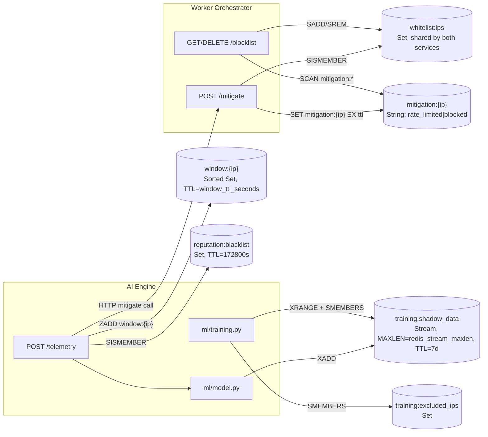

# Data Model: Redis Key Schema

There is no relational database in this system — Redis is the single source
of runtime state for both `ai_engine` and `worker_orchestrator` (see
`docs/architecture.md`, "Tier 4 — State"). This document maps every key the
code actually reads or writes (verified against source, not just the design
docs) instead of a traditional ER diagram.

## Key flow

## Keys

| Key | Type | Written by | Read by | TTL / lifecycle |
|---|---|---|---|---|
| `window:{ip}` | Sorted Set (member=JSON log record, score=unix ts) | AI Engine `telemetry.py::store_logs_to_window` | AI Engine `ml/feature_engineering.py` (5s sliding window query) | `EXPIRE window_ttl_seconds` (default 10s) after every write; stale members pruned via `ZREMRANGEBYSCORE` on each batch |
| `reputation:blacklist` | Set of IPs | `scripts/deploy.sh` step 10 (seeds from FireHOL Level 1) + `scripts/update-ip-reputation.sh` (daily CronJob, `k8s/reputation/cronjob.yaml`) | AI Engine `telemetry.py::check_ip_reputation` | `EXPIRE 172800` (2 days) reset on each reload |
| `whitelist:ips` | Set of IPs | AI Engine `POST /whitelist`, Worker `POST /whitelist` | AI Engine (feature-vector skip — *not currently checked in telemetry.py, see gap below*), Worker `POST /mitigate` (skip check) | No TTL — manual add/remove only |
| `training:excluded_ips` | Set of IPs | AI Engine `POST /whitelist` (added alongside `whitelist:ips`) | AI Engine `ml/training.py::_read_shadow_data` (excludes from training set) | No TTL |
| `training:shadow_data` | Stream (fields: `remote_addr`, `score`, `features` (JSON list[float]), `ts`) | AI Engine `ml/training.py::store_shadow_vector`, called on every scored vector in `telemetry.py` | AI Engine `ml/training.py::run_baseline_training` / `run_daily_retrain` | `XADD ... MAXLEN redis_stream_maxlen approximate=True` (default 500,000) + `EXPIRE 7*24*3600` (7 days) reset on every write |
| `mitigation:{ip}` | String (`"rate_limited"` or `"blocked"`) | Worker `POST /mitigate` | Worker `GET /blocklist` (via `SCAN mitigation:*`), `DELETE /blocklist/{ip}` | `EX tier1_ttl_seconds` (300s, Tier 1) or `EX tier2_ttl_seconds` (3600s, Tier 2) |

Tier 2 (`blocked`) mitigations additionally patch the `nginx-blocklist`
ConfigMap directly via the Kubernetes API (`orchestrator/configmap_patcher.py`)
so Nginx enforces the deny rule — the Redis key is bookkeeping/TTL tracking
for the blocklist API, not the enforcement mechanism itself for Tier 2.
Tier 1 (`rate_limited`) currently has no enforcement side effect beyond the
Redis key — see gap below.

## Gaps found while mapping this — resolved, implementation tracked in PLAN.md

1. **`whitelist:ips` is written by both services but only read by
   `worker_orchestrator`.** `ai_engine/api/routes/telemetry.py` never checks
   the whitelist before scoring/mitigating an IP — only the reputation
   blacklist is checked pre-ML. A whitelisted IP still gets ML-scored and a
   mitigation HTTP call is still sent to the Worker Orchestrator on every
   anomalous batch (the Worker then correctly no-ops via its own whitelist
   check). Functionally safe today, but wasteful and inconsistent with the
   "feedback loop" in `docs/mlops-design.md`.

   **Decision (2026-08-20):** hybrid fix, Stage 1 of `docs/PLAN.md`. Keep
   feature computation + ML scoring running for every IP including
   whitelisted ones (shadow stream / drift data must not be lost). Add the
   whitelist check only at the mitigation-trigger boundary: in
   `telemetry.py`, once an IP scores anomalous, `SISMEMBER whitelist:ips`
   before sending the HTTP call to the Worker — skip the call if
   whitelisted. Runs only on already-anomalous IPs, so no caching needed.
   Add a `ai_whitelist_suppressed_total` Prometheus counter (how often ML
   wanted to mitigate a whitelisted IP — a signal for threshold tuning).

2. **Tier 1 (`rate_limited`) has no observed enforcement action** in
   `worker_orchestrator/api/routes/mitigate.py` beyond setting the Redis key
   — no ConfigMap patch, no Nginx signal, unlike Tier 2.

   **Decision (2026-08-20):** not intentional bookkeeping — build real
   per-IP dynamic enforcement. New PLAN.md stage (Stage 2) right after
   Stage 1: Nginx `geo`/`map`-driven `limit_req_zone` keyed off a
   ConfigMap-mounted IP list, `configmap_patcher.py` generalized to a
   single class with two instances (blocklist "deny IP;" format, ratelimit
   "IP 1;" format), `mitigate.py` Tier 1 made symmetric with Tier 2 (patch +
   reload), and the TTL cleanup job extended to remove expired Tier 1
   entries from the ratelimit ConfigMap the same way it already does for
   Tier 2. Full design in `docs/PLAN.md` Stage 2.
