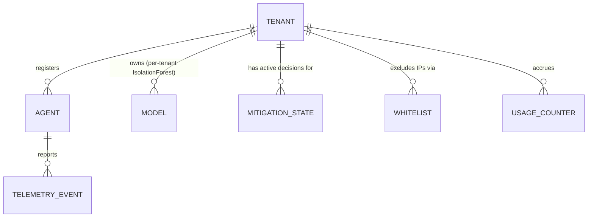

# Data model — hybrid free model (DynamoDB)

> Supersedes the Redis-based schema for the abandoned single-org model. See
> `docs/adr/002-tech-stack-hybrid.md` for why: no persistent server is
> Always-Free forever on AWS, so all runtime state moves to DynamoDB
> (Always Free: 25GB storage + 25 RCU/WCU, forever).
>
> **Billing mode: PROVISIONED, not on-demand.** The Always-Free allowance
> only applies to provisioned capacity — on-demand (`PAY_PER_REQUEST`)
> bills from the first request with no free tier at all. Every table below
> (plus the `Agents.LastSeenIndex` GSI, billed separately from its base
> table) is provisioned with an explicit RCU/WCU number that sums to ≤25/25
> account-wide; see `docs/PLAN.md` Stage 1 for the exact per-table budget.

## Entity relationships

## Tables

### `Tenants`
| Key | Attribute | Type | Notes |
|---|---|---|---|
| PK | `tenant_id` | S | ULID |
| | `name` | S | |
| | `contact_email` | S | |
| | `created_at` | S | ISO 8601 |
| | `status` | S | `active` \| `suspended` |

### `Agents`
| Key | Attribute | Type | Notes |
|---|---|---|---|
| PK | `tenant_id` | S | |
| SK | `agent_id` | S | ULID, generated at registration (CLI) |
| | `registered_at` | S | |
| | `last_seen_at` | S | updated on each telemetry batch |
| | `agent_version` | S | |
| | `api_key_hash` | S | hashed, never store plaintext |
| | `status` | S | `active` \| `stale` \| `revoked` |

GSI `LastSeenIndex` (PK `status`, SK `last_seen_at`) — lets the Control
Platform list stale/dead agents across all tenants without a table scan.

### `Models`
| Key | Attribute | Type | Notes |
|---|---|---|---|
| PK | `tenant_id` | S | |
| SK | `stage_version` | S | `production`, `staging#<ts>`, `archive#<ts>` |
| | `model_blob` | B | gzip(joblib.dump(IsolationForest)); **must stay under DynamoDB's 400KB item limit — verified at `n_estimators=50` ≈ 238KB gzip, see ADR-002** |
| | `trained_at` | S | |
| | `training_samples` | N | |
| | `contamination` | N | |
| | `score_mean` / `score_std` | N | |
| | `features` | SS | feature name list, must match `feature_config.py` |

### `MitigationState`
Replaces the old Redis TTL keys for active rate-limit/block decisions.
| Key | Attribute | Type | Notes |
|---|---|---|---|
| PK | `tenant_id` | S | |
| SK | `ip` | S | |
| | `tier` | N | 0=normal, 1=rate-limit, 2=hard-block (same enum as `ml/model.py::AnomalyTier`) |
| | `score` | N | IsolationForest decision score |
| | `reason` | S | |
| | `expires_at` | N | epoch seconds — set as the table's **native DynamoDB TTL attribute** (free auto-expiry, replaces Redis key TTL) |

### `Whitelist`
| Key | Attribute | Type | Notes |
|---|---|---|---|
| PK | `tenant_id` | S | |
| SK | `ip` | S | |
| | `added_at` | S | |
| | `added_by` | S | dashboard user or CLI |

### `TelemetryEvents`
Not one item per request — one **aggregate item per (tenant, ip, time
bucket)**, updated with atomic numeric `ADD` operations. An earlier draft
stored one item per raw log line plus growing `uris`/`user_agents` lists;
both were found to defeat the table's own purpose (WCU cost scaled with
raw request volume — worst exactly during a real attack) and were replaced
with this fixed-size design before Phase 2 sign-off. See `docs/PLAN.md`
Stage 2 for the full aggregation code and the sliding-window-counter read
pattern (current bucket + weighted previous bucket, closing the
fixed-bucket-boundary evasion gap).
| Key | Attribute | Type | Notes |
|---|---|---|---|
| PK | `tenant_ip` | S | `"{tenant_id}#{ip}"` |
| SK | `bucket_start_ts` | N | epoch seconds, floored to the bucket size (default 5s) |
| | `tenant_id`, `ip` | S, S | plain attributes, not just embedded in `tenant_ip` — added in Stage 7 so the `TenantIndex` GSI below can query by tenant without parsing the composite key |
| | `request_count`, `error_count`, `post_count` | N | atomic `ADD` per batch |
| | `total_bytes`, `total_time` | N | atomic `ADD` per batch, sums for averaging |
| | `distinct_uri_count`, `distinct_ua_count` | N | computed once per batch in Lambda memory, then `ADD`ed — bounded size regardless of traffic volume, unlike a stored list |
| | `ttl` | N | native DynamoDB TTL, **90,000s (25h)** — raised from an initial 1h default in Stage 7: this table backs the ~24h shadow/training window described above, and 1h was deleting almost all of a tenant's data before the daily retrain ever ran |

GSI `TenantIndex` (PK `tenant_id`, SK `bucket_start_ts`) — added in Stage 7
so the daily retrain job (`docs/PLAN.md`) can gather one tenant's training
data across every IP and bucket. `query_by_tenant()` on this table still
deliberately raises `NotImplementedError` (Stage 2) since the *base
table's* key can't do this — use `query_since(tenant_id, since_ts)`
instead, which queries this GSI.

### `UsageCounters`
Exists specifically to protect the 0đ constraint — the Control Platform
reads this to warn before any Always-Free ceiling (Lambda 1M req/month +
400,000 GB-seconds; DynamoDB 25 RCU/WCU) is reached.
| Key | Attribute | Type | Notes |
|---|---|---|---|
| PK | `date` | S | `YYYY-MM-DD` |
| | `total_requests` | N | incremented per Lambda invocation |
| | `estimated_gb_seconds` | N | |
| | `dynamodb_consumed_rcu` / `_wcu` | N | |

## Notes carried over from the old Redis design

- Old `docs/schema.md` (Redis) documented sliding-window sorted sets for
  per-IP feature computation. DynamoDB has no free equivalent range-query
  primitive — Phase 3 must design the sliding window as explicit item
  writes with a bounded SK range query (`event_ts BETWEEN`) against
  `TelemetryEvents`, not assume it "just works" the same way.
- `expires_at`/`ttl` fields are DynamoDB's native Time To Live feature
  (item auto-deleted by AWS, no cost, best-effort within 48h) — this is the
  direct replacement for Redis `EXPIRE`, not a new invention.
